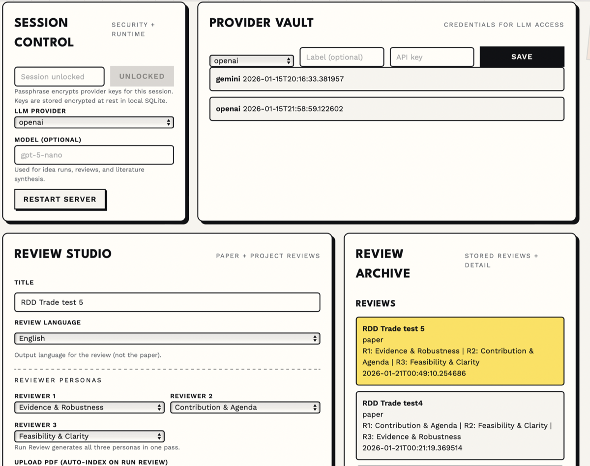
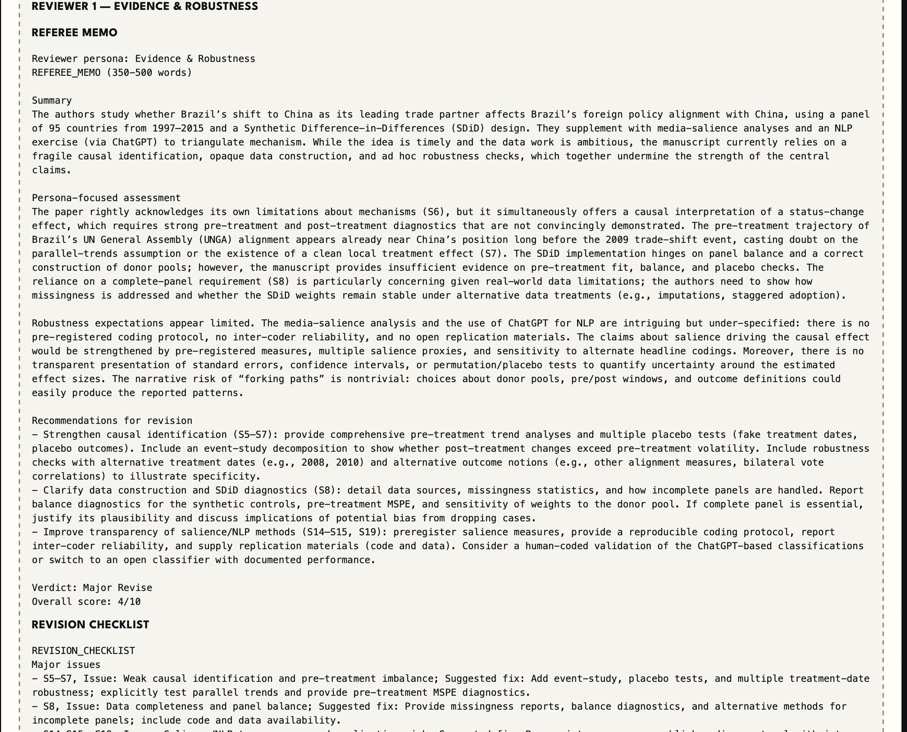

# IPE Breakthrough Idea Swarm

Local web app to orchestrate a swarm of AI agents that generate, vet, and package breakthrough International Political Economy (IPE) research ideas, and to run APSR-level reviews of papers or research proposals (IC, Mestrado, Doutorado, Research Grant). Ideation is design-only and anchored in DiD/SCM/Shift-Share or ideal points, while Review mode is method-agnostic and critiques theory/design/evidence without executing analysis. The system produces structured idea dossiers plus persona-based referee memos and revision checklists.

## Features
- Idea dossier generation (PITCH, DESIGN, DATA_PLAN, POSITIONING, NEXT_STEPS)
- Council review workflow with gates and memo scoring
- Literature pipeline (metadata fetch, PDF ingest, assessments)
- LLM-based literature assessment (optional) using provider credentials
- Resubmission workflow with dossier version snapshots and council rounds
- Review mode for papers and projects (3-persona Referee Memos + Revision Checklists)
- Review PDF ingestion with section indexing and grounding
- LLM-driven review generation with validation notes when formatting breaks

## Screenshots
Landing page: choose a workflow among Idea Lab, Paper Review, and Project Review.


Paper Review workflow (APSR-level): set reviewers, upload a PDF, and run the review.


Paper Review detail: reviewer outputs and artifacts after the run completes.


## Requirements
- Python 3.11+
- A local virtualenv (recommended)

## Setup
```bash
python3 -m venv .venv
. .venv/bin/activate
pip install -r requirements.txt
```

## One-click local start (recommended)
1) Download the repo (ZIP) and extract it.
2) Ensure Python is installed (Windows: check “Add Python to PATH”).
3) Double-click (or run):
   - Windows: `Start-App.cmd`
   - macOS: `Start-App.command`
   - Linux: `Start-App.sh`

Then open: http://127.0.0.1:8001/

## Run the server
```bash
. .venv/bin/activate
python -m uvicorn app.main:app --host 127.0.0.1 --port 8001
```

Or, using the built-in module runner:
```bash
. .venv/bin/activate
python -m app
```

Or a one-liner helper (opens the browser):
```bash
./run_app.sh
```

Open the UI:
- http://127.0.0.1:8001/

## Quick usage
1) Unlock session (passphrase)
2) Save provider credentials (OpenAI/Anthropic/Gemini)
3) (Optional) Run LLM assessment for a literature query
4) Start swarm and review dossiers
5) Choose reviewer personas, upload a PDF, and Run Review (uploads + indexes + generates memo/checklist)

## Run form fields
- Idea count: how many idea dossiers to generate in a single swarm run.
- Topic focus: optional hint to steer generation toward a specific IPE topic or lane.
- Exclude topics: optional list of topics to avoid (separate with ';').
- Use assessment idea prompts: if enabled, seed each idea from the assessment’s “idea prompts” section.

## Review workflow
1) Choose the workflow (Paper or Project).
2) Select three reviewer personas (duplicates allowed with confirmation).
3) Upload a PDF and click Run Review.
4) The app creates the review (if needed), indexes sections, and generates 3 Referee Memos + 3 Revision Checklists.

Validation notes are appended when output formatting fails (e.g., missing Quote lines for minor issues).
Review mode is method-agnostic and does not require breakthrough-level contributions.

Language: set Review language to `en` or `pt` in the Review form (default `en`).

Review personas:
- Theory & Positioning
- Identification & Design
- Measurement & Constructs
- Contribution & Agenda
- Feasibility & Clarity
- Evidence & Robustness

## Council personas
- Referee A: theory + positioning
- Referee B: identification
- Referee C: measurement/construct validity
- Referee D: magnitude of contribution / agenda-setting
- Referee E: data feasibility

## Tests
```bash
. .venv/bin/activate
python -m pytest
```

## Review harness
```bash
. .venv/bin/activate
python scripts/run_review_harness.py
```

## Frozen MVP (tagged)
The stable MVP is tagged as `mvp-v1`. To run it:
```bash
git checkout mvp-v1
. .venv/bin/activate
python -m uvicorn app.main:app --host 127.0.0.1 --port 8001
```

To return to current development:
```bash
git checkout main
```

## Notes
- No execution or estimation is performed; review mode critiques evidence as written without re-running analysis.
- LLM assessments are optional and depend on provider quotas.
- OpenAI requests use a 180s timeout and retry once on read timeouts.
- Click a selected literature query again to clear the selection.
